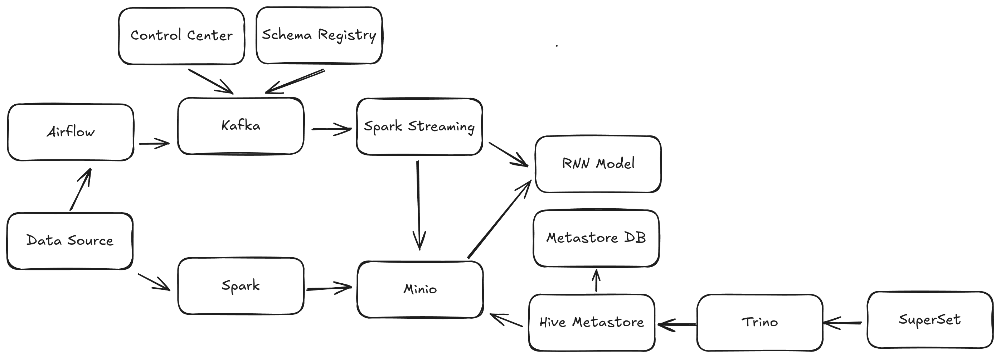

# STOCK PREDICTION

## Overview
- This is my GR1 project at HUST (Hanoi University of Science and Technologies). This project is about big data ingestion, processing and analysis (just for learning purpose)

## Architecture


- Follow the Lambda Architecture

## Techonologies
- Minio for Object Storage
- Apache Spark, Spark Streaming for data processing
- Apache Kafka for real-time data ingestion
- Apache Airflow for job scheduling

## Prerequisites
- Python, Docker, Docker Compose, Ubuntu

## Dataset
- Download the dataset and save into the `data/raw` directory 
- This dataset belong to [Oleg Shpagin](https://www.kaggle.com/olegshpagin) from [Kaggle](https://www.kaggle.com/)
### USA 514 Stocks Prices NASDAQ NYSE

The USA 514 Stocks Prices Dataset provides historical Open, High, Low, Close, and Volume (OHLCV) prices of 514 stocks traded in the United States financial markets NASDAQ NYSE. You can use price movements and trading volumes for stock price predictions.

### ~11 Gb of market data for you and your analysis with NN or other methods 

Here is the link to kaggle dataset [USA 514 Stocks Prices NASDAQ NYSE](https://www.kaggle.com/datasets/olegshpagin/usa-stocks-prices-ohlcv) (weekly updates)

#### 4626 CSV files for MN1, W1, D1, H4, H1, M30, M15, M10 and M5 timeframes

## To run this project
- Create python virtual enviroment
```sh
python3 -m venv venv
source venv/bin/activate

pip install -r requirements.txt
```